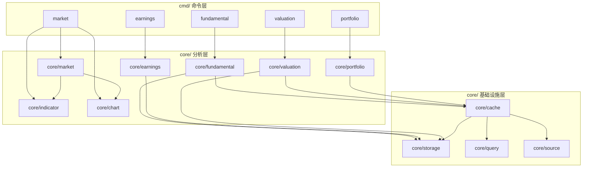

# Analyst Suite 技术设计

Feature Name: analyst-suite
Updated: 2026-09-16

## Description

在 AxData-go 上补充五个分析模块，形成"采集 → 分析 → 决策"闭环：

| 模块 | 目录 | 定位 |
|------|------|------|
| Stock Market Pro | `core/market`, `core/indicator`, `core/chart` | 盯行情、看盘、出带指标图表 |
| Longbridge Fundamentals | `core/fundamental` | 财务报表、主营构成、行业地位、估值倍数 |
| Earnings Analysis | `core/earnings` | 财报前瞻与复盘、指引变化 |
| DCF Valuation | `core/valuation` | 现金流折现、安全边际 |
| Diversification | `core/portfolio` | 相关性矩阵、分散度、再平衡建议 |

核心原则：本地优先（Local-First）。所有模块先读本地 Parquet，缺失才回源，回源结果回写缓存。

## Architecture



新增 `core/cache` 作为统一的数据获取门面，封装"本地优先 + 回源 + 回写"逻辑，避免五个模块各自实现重复的回退路径。

## Components and Interfaces

### 1. `core/indicator` — 纯函数指标引擎

无 I/O、无外部依赖的纯计算包，输入输出均为 `[]float64` 序列。

```go
package indicator

type Errors struct{}
var (
    ErrInsufficientData = errors.New("insufficient data")
)

type Series struct {
    Dates []string
    Values []float64
}

func MA(values []float64, period int) ([]float64, error)
func EMA(values []float64, period int) ([]float64, error)
func RSI(values []float64, period int) ([]float64, error)
func MACD(values []float64, fast, slow, signal int) (*MACDResult, error)
func KDJ(high, low, close []float64, n, k, d int) (*KDJResult, error)
func BOLL(close []float64, period, mult int) (*BOLLResult, error)
func ATR(high, low, close []float64, period int) ([]float64, error)
```

`ErrInsufficientData` 通过 `errors.Is` 判定，携带所需最小样本数。

### 2. `core/chart` — 双格式渲染器

```go
package chart

type ChartData struct {
    Code string
    Dates []string
    Open, High, Low, Close []float64
    Volume []float64
    MA5, MA10, MA20 []float64
    RSI []float64
    MACDDiff, MACDSignal, MACDHist []float64
}

func RenderASCII(data *ChartData, rows, cols int) string
func RenderSVG(data *ChartData, width, height int) string
```

ASCII 渲染使用 K 线块字符 + RSI/MACD 折线行；SVG 为单文件、内联样式、无外部资源。

### 3. `core/cache` — 本地优先数据门面

```go
package cache

type Getter struct {
    Cfg   *config.Config
    Store *storage.Store
    Query *query.Querier
    Logger *zap.Logger
}

// FetchTable 按本地优先策略获取一张表的记录
// preferLocal=true 时命中本地即返回；否则本地记录不足 minRows 时回源
func (g *Getter) FetchTable(ctx context.Context, table string, minRows int,
    fetchFn func(ctx context.Context) ([]map[string]interface{}, error)) ([]map[string]interface{}, error)

// FetchRows 查询指定表并返回列名对齐的行
func (g *Getter) FetchRows(ctx context.Context, table string, where map[string]string) ([]map[string]interface{}, error)
```

### 4. `core/market` — Stock Market Pro

```go
type Quote struct {
    Code, Name string
    Price, ChangePct, Volume, Amount float64
    PE, PB, TotalMarketCap float64
    Source string
}

type Market struct{ getter *cache.Getter; logger *zap.Logger }

func NewMarket(getter *cache.Getter, logger *zap.Logger) *Market
func (m *Market) Quote(ctx context.Context, codes []string) ([]Quote, error)
func (m *Market) Kline(ctx context.Context, code string, limit int) (*indicator.Series, []float64, []float64, []float64, error)
func (m *Market) BuildChart(ctx context.Context, code string, limit int) (*chart.ChartData, error)
```

行情回退顺序：`tencent` → `eastmoney` → `sina`。

### 5. `core/fundamental` — Longbridge Fundamentals

```go
type Report struct {
    Company    CompanyInfo
    Financials []PeriodFinancials
    Business   []BusinessItem
    Industry   IndustryPosition
    Valuation  ValuationMultiples
    Missing    []MissingNote
}

func NewFundamental(getter *cache.Getter, logger *zap.Logger) *Fundamental
func (f *Fundamental) Report(ctx context.Context, code string) (*Report, error)
func (r *Report) RenderMarkdown() string
```

### 6. `core/earnings` — Earnings Analysis

```go
type Report struct {
    Forecast   []ForecastItem
    Review     ReviewResult
    Consensus  []ConsensusItem
    Summary    []string
}

func NewEarnings(getter *cache.Getter, logger *zap.Logger) *Earnings
func (e *Earnings) Report(ctx context.Context, code string) (*Report, error)
```

超预期判定：实际值 > 预告上限 → `超预期`；落在区间内 → `符合预期`；< 下限 → `低于预期`；无预告 → `无预告可比`。

### 7. `core/valuation` — DCF

```go
type Assumptions struct {
    ExplicitYears  int
    GrowthRate     float64
    WACC           float64
    TerminalGrowth float64
    NetDebt        float64
    SharesOut      float64
}

type Result struct {
    EnterpriseValue, EquityValue, IntrinsicValuePerShare float64
    CurrentPrice, MarginOfSafety float64
    FreeCashFlowProxy string
    Sensitivity [][][]float64
}

func DCF(freeCashFlow []float64, assumptions Assumptions, currentPrice float64) (*Result, error)
```

### 8. `core/portfolio` — Diversification

```go
type Holding struct { Code string; Weight float64 }

type Result struct {
    CorrelationMatrix [][]float64
    PortfolioVolatility float64
    RiskContribution []RiskContribution
    HHI float64
    DiversificationRatio float64
    HighCorrelationPairs []AssetPair
    Recommendations []string
}

func Analyze(returns map[string][]float64, holdings []Holding) (*Result, error)
```

## Data Models

新增表（登记于 `core/schema`）：

| 表名 | 来源接口 | 关键字段 |
|------|---------|---------|
| `fin_income` | eastmoney_financial_income | ts_code, report_date, revenue, net_profit, gross_margin, roe |
| `fin_balance` | eastmoney_financial_balance | ts_code, report_date, total_assets, total_liabilities, equity_ratio |
| `fin_cashflow` | eastmoney_financial_cashflow | ts_code, report_date, ocf, capex, free_cash_flow |
| `business_scope` | eastmoney_business_scope | ts_code, report_date, item_name, income, ratio |
| `earnings_forecast` | eastmoney_earnings_forecast | ts_code, report_date, notice_date, forecast_type, profit_low, profit_high, change_low, change_high |
| `valuation_snapshot` | eastmoney_valuation_snapshot | ts_code, trade_date, close_price, pe_ttm, pb, ps_ttm, peg, total_market_cap, free_market_cap |

## Correctness Properties

1. `MA/MACD/BOLL` 对常数序列返回常数序列（除 MA 前 `period-1` 个位置）。
2. `RSI` 输出恒在 `[0, 100]` 区间。
3. `BOLL` 恒满足 `Upper >= Middle >= Lower`。
4. DCF 在 `WACC > TerminalGrowth` 前提下方能收敛，否则返回错误。
5. 相关性矩阵对角线恒为 1.0，且矩阵对称。
6. 权重归一化后 `HHI` 恒在 `[1/N, 1.0]` 区间。

## Error Handling

- 数据源全部失败：返回聚合错误，包含每个数据源的失败原因。
- 单板块数据缺失：`Report.Missing` 记录原因，其余板块正常输出。
- 数值不足：`ErrInsufficientData`，附带所需最小样本数。
- 除零/负数：DCF 与相关性计算前置校验，返回带字段名的错误。
- 所有降级路径在日志中记录 `warn` 级别，终端输出中给出可见提示。

## Test Strategy

- `core/indicator`：常数序列、递增序列、已知手工计算值对照；边界样本数；负值/零值输入。
- `core/chart`：SVG 结构合法性（含必需标签）、ASCII 行数稳定性、空数据输入。
- `core/cache`：本地命中不回源、本地不足回源并回写、回源失败降级。
- `core/valuation`：与手工 DCF 计算对照；敏感性矩阵维度；WACC<=g 报错。
- `core/portfolio`：对称性与对角线；完全相关资产；单资产组合。
- `core/fundamental`、`core/earnings`：用 fixture 记录验证板块输出与 JSON 序列化。
- 全部使用 `go test -count=1`，无网络依赖，指标与统计部分覆盖为核心路径。

## References

[^1]: (core/source/provider.go) - ProviderInterface 与 ProviderRegistry 声明模式
[^2]: (core/storage/storage.go) - Parquet 存储与 Record 结构
[^3]: (core/query/querier.go) - DuckDB 查询器接口
[^4]: (core/schema/schema.go) - TableRegistry 表登记模式
